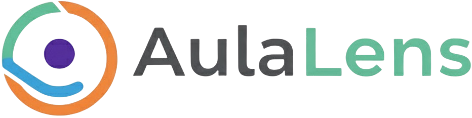

<p align="center">
  
</p>

# AulaLens

### Una lente de claridad para Google Classroom.
*Proyecto creado para la [Vibeathon](https://nerdearla.devpost.com/) de [Nerdearla 2025](https://nerdear.la/).*

## 🚀 Demos

* **Aplicación en vivo:** **[Accede a AulaLens aquí](https://aula-lens.vercel.app/)**
* **Video Demo (2 min):** **[Mira el video en YouTube](https://youtu.be/aVMRMPnPnxI)**


## 🎯 El Problema

**[Semillero Digital](https://semillerodigital.org/)** es una ONG que transforma la vida de jóvenes a través de la formación en oficios digitales. Utilizan Google Classroom como su plataforma principal, pero se enfrentan a tres desafíos clave:

1.  **Seguimiento del Progreso:** Carencia de una vista consolidada para rastrear el avance de cada alumno, clase y profesor de forma centralizada.
2.  **Comunicación Fragmentada:** Los estudiantes a menudo pierden notificaciones importantes como enlaces de clases, fechas de entrega o cambios de calendario.
3.  **Métricas Inaccesibles:** El equipo de coordinación necesita datos de asistencia y entregas de forma ágil, pero la extracción manual desde Classroom es un proceso lento y complejo.

## ✨ La Solución: AulaLens

**AulaLens** es una aplicación web complementaria que se conecta directamente a la API de Google Classroom para resolver estos problemas. No busca reemplazar Classroom, sino añadir una **capa de visualización y gestión inteligente** que potencia la experiencia para tres roles clave:

* **Profesores:** Visualizan el rendimiento de sus clases y el estado de las entregas de forma sencilla.
* **Alumnos:** Tienen un dashboard claro con sus tareas pendientes y su progreso general.

## 🛠️ Características Principales

### Funcionalidades del MVP
* **✅ Conexión Segura con Google API:** Autenticación vía OAuth 2.0 para acceder a los datos de Classroom de forma segura.
* **📊 Dashboard Centralizado:** Una interfaz única que muestra listas de alumnos, profesores, cursos y el estado de las tareas.
* **PROGRESS BARS Progreso Visual del Alumno:** Indicadores visuales (ej. barras de progreso) para ver el porcentaje de tareas completadas por cada estudiante.
* **🔎 Filtros Dinámicos:** Capacidad para filtrar la información por cohorte (curso), profesor y estado de entrega (entregado, atrasado, faltante).

### Funcionalidades Extras ✨
* **🩺 "Health Score" del Estudiante:** Un algoritmo que asigna un puntaje de "salud académica" a cada alumno basado en puntualidad y completitud, permitiendo a los profesores intervenir proactivamente.
* **📈 Reportes Gráficos:** Visualizaciones de datos como el porcentaje de entregas a tiempo vs. atrasadas.
* **🎭 Vistas por Roles:** La interfaz se adapta mostrando la información más relevante según si el usuario es profesor o alumno.

## 💻 Tech Stack

| Área                | Tecnología                                                                                      |
| ------------------- | ----------------------------------------------------------------------------------------------- |
| **Framework** | [Nuxt.js 3](https://nuxt.com/)                                                                  |
| **UI Kit** | [Nuxt UI](https://ui.nuxt.com/) & [Tailwind CSS](https://tailwindcss.com/)                        |
| **Autenticación** | [Nuxt Auth](https://sidebase.io/nuxt-auth/getting-started) para el flujo OAuth 2.0 con Google   |
| **API de Google** | [googleapis](https://github.com/googleapis/google-api-nodejs-client) (Librería oficial para Node.js) |
| **Despliegue** | [Vercel](https://vercel.com/)                                                                   |

## 🏁 Cómo levantar el proyecto localmente

Sigue estos pasos para configurar y ejecutar AulaLens en tu máquina local.

### Pre-requisitos
* [Node.js](https://nodejs.org/) (versión 18.x o superior)
* Un gestor de paquetes como `pnpm` o similar.

### Instalación

1.  **Clona el repositorio:**
    ```bash
    git clone https://github.com/TU_USUARIO/AulaLens.git
    cd AulaLens
    ```

2.  **Instala las dependencias:**
    ```bash
    pnpm install
    ```

3.  **Configura las variables de entorno:**
    * Crea una copia del archivo de ejemplo `.env.example` y renómbrala a `.env`.
        ```bash
        cp .env.example .env
        ```
    * Abre el archivo `.env` y añade tus credenciales de la API de Google y un secreto para `nuxt-auth` (puedes usar [https://generate-secret.vercel.app/32](https://generate-secret.vercel.app/32)):
        ```env
        # Genera un secreto aleatorio para firmar las sesiones
        NUXT_AUTH_SECRET=un_secreto_muy_largo_y_seguro

        # Credenciales obtenidas desde Google Cloud Console
        GOOGLE_CLIENT_ID=tu_client_id.apps.googleusercontent.com
        GOOGLE_CLIENT_SECRET=tu_client_secret
        ```

### Ejecutar la aplicación

1.  **Inicia el servidor de desarrollo:**
    ```bash
    pnpm run dev
    ```

2.  **Abre tu navegador:**
    * La aplicación estará disponible en [http://localhost:3000](http://localhost:3000).

## 📄 Licencia

Este proyecto está bajo la Licencia MIT. Consulta el archivo [`LICENSE`](./LICENSE) para más detalles.